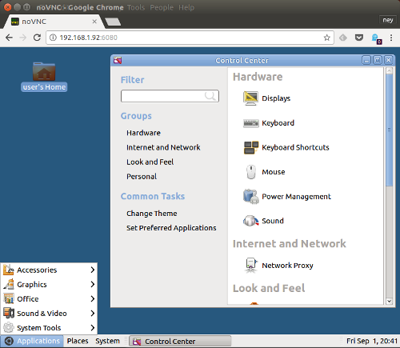

# docker remote desktop

My effort to create a simple remote desktop packed as docker container



* public access only over SSH 
* VNC server (local only. need ssh tunnel to access)
* Container user defined by env variables (uid, group, username, password)
* simple desktop to fast remote desktop

## build
```
docker build -t neyfrota/remote-desktop .
```

## run

```
docker run -d -p 22:22 neyfrota/remote-desktop
```

## ssh connect

```
ssh user@localhost
```

## vnc connect (command line)

SSH connect with port forward at 5900. Leave this connection active.
```
ssh -L5900:127.0.0.1:5900 user@localhost
```
Connect vnc viewer local (port 5900 is default)
```
gvncviewer localhost
```


## env variables

* uid: container unix user numeric id (default 1000)
* gid: container unix group numeric id (default 1000)
* group: container unix group name (default user)
* username: container unix user name (default user)
* password: container unix user password (default password)
* resolution: vnc geometry (default 1024x768)

example

```
docker run -d \
-e "uid=1000" \
-e "gid=1000" \
-e "username=user" \
-e "password=password" \
-e "resolution=800x600" \
-v /tmp/docker-desktop-home:/home \
-p 22:22 \
neyfrota/remote-desktop
```
