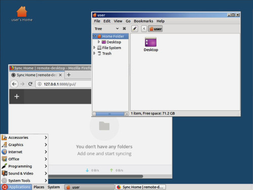

# Docker remote desktop

My effort to create a simple remote desktop packed as docker container



* Public access only over SSH only by ssh key (safe and secure)
* Local [VNC](https://en.wikipedia.org/wiki/Virtual_Network_Computing) server (need ssh tunnel to access)
* Simple [Mate desktop](https://mate-desktop.org/) for fast remote access
* My basic apps of choice(firefox, nicotine, transmission, baobab, vlc, etc)
* My basic sync app of choice (Free [resilio sync](https://www.resilio.com/individuals/) at http://127.0.0.1:8888)
* Container user defined by env variables (username, uid, gid, public key)

# Test

This is a local test to check remote desktop.
No need git pull this repo. Use docker hub public image.
You need setup [passwordless SSH login](https://scotch.io/tutorials/how-to-setup-ssh-public-key-authentication) to get your ssh keys.

Start server using the ssh public key from your active user.

```docker run -d -p 22:22 -e "pubkey=$(cat ~/.ssh/id_rsa.pub)" neyfrota/remote-desktop```

Ssh to localhost using default user.

```ssh user@localhost```

VNC is not public exposed. We need SSH tunnel and port forward VNC traffic.
This increase setup complexity but guarantee a safe and protected VNC connection (even in untrusted public wifi)

Exit previous connection and start a new one with VNC port forward.

```ssh -L5900:127.0.0.1:5900 user@localhost```

Now open VNC client and connect to localhost. No VNC password need becuase we are already protected by ssh

```gvncviewer localhost```


# Details

#### Persistence

By default, instance data are ephemeral.
This is a feature, not a bug.
We need some actions to persist user files across usage.
We can mount user home at host for data persistence.

```docker run -d -p 22:22 -e "pubkey=$(cat ~/.ssh/id_rsa.pub)" -v /tmp/user-at-host:/home/user neyfrota/remote-desktop```

After first launch with home persistence, we can do next launches without pubkey.

#### ENV variables

* uid: container unix user numeric id (default 1000)
* gid: container unix group numeric id (default 1000)
* group: container unix group name (default user)
* username: container unix user name (default user)
* pubkey: public key content. usually at ~/.ssh/id_rsa.pub
* resolution: vnc geometry (default 1024x768)

We can use uid/gid/group to fine tune and mach internal remote desktop user with same settings as a host specific user.


# Setup remote desktop

In your local machine, get your user public key and save output for next steps

```
cat ~/.ssh/id_rsa.pub
```

In your remote machine, create a folder to store remote desktop /home folder

```
mkdir /home-remote-desktop
```

Start remote desktop with correct pubkey (from local machine) and folder persistence

```
docker run -d \
-e "pubkey=ssh-rsa AAAA....xQ0= user" \
-e "resolution=800x600" \
-v /home-remote-desktop:/home \
-p 22:22 \
neyfrota/remote-desktop
```
From your local machine ssh test and then exit if ok

```
ssh user@remoteMachine
```

This command connect to ssh, create a tunnel, launch vnc viewer and then disconnect ssh tunnel at end of VNC connection.

```
ssh -f -o ExitOnForwardFailure=yes -L5900:127.0.0.1:5900 user@remoteMachine sleep 10 && gvncviewer 127.0.0.1
```

# VNC clients

(todo: add vnc clients compatible with ssh tunnel for android/ios/windows)
